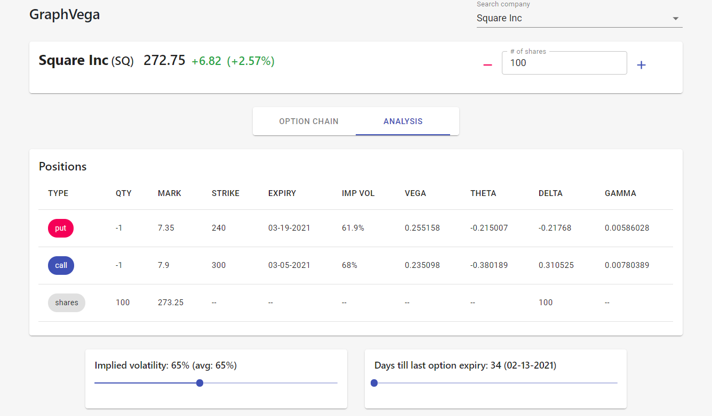
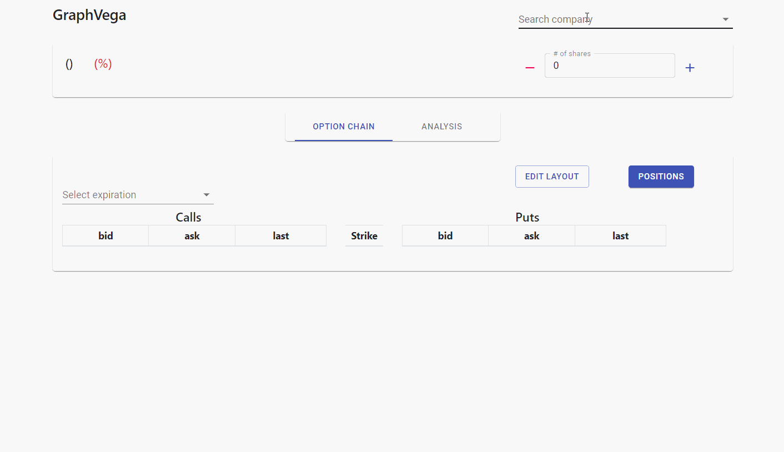

<p align="center">


<h1 align="center">

GraphVega  


</h1>

</p>

## :gem: About The Project

GraphVega is an open sourced options analytics platform that analyses
and projects the P/L of a multi-legged options position with variation
of the stock price under changes in volatility and days till expiration,
using a black-scholes simulation.

It is designed with a goal to provide a simple and intuitive interface
to analyze options, while also providing developers with the flexibility
to add their own custom features.

<p align="center" style="box-shadow: 2px 2px 2px black;">



</p>

## :rocket: Getting Started

**Note**: You will need to have NodeJS installed on your machine to run this app. If you don't have it on your machine already, you can install it [here](https://nodejs.org/en/download/) for free.

To get GraphVega up and running on your local machine, follow these steps:

1.  Clone the repository
    
    ```
    $ git clone  https://github.com/rahuljoshi44/GraphVega.git
    ```

2.  Switch to the root directory of the project (main folder where all the files are stored) and install the
    dependencies. This process might take a couple minutes depending on your download speed, so please wait!
    ```
    $ npm install
    ```

3.  Get a free API Key (for sandbox) from Tradier
    [here](https://developer.tradier.com/user/sign_up?_ga=2.9691381.1305307848.1613100396-1783872143.1609733953).
    This project uses Tradier’s market data API for options and stock
    prices.

4.  In the root directory  create a `.env` file and enter your API key and the API url as
    follows:
    ```
    TRADIER_API_KEY=YOUR_API_KEY_HERE
    API_BASE_URL=https://sandbox.tradier.com/v1/
    ```
    Replace `YOUR_API_KEY_HERE` with the API key you obtained from step 3.
    NOTE: You can also change the variable `API_BASE_URL` to the brokerage API url if you'd like to use the brokerage API endpoint.

5.  Run the application in either of two ways: Locally or via Docker (explained below):

### Locally
In the root directory, run the following command:

    $ npm start

Note that the front end react app runs on `http://localhost:3000` while
the server runs on `http://localhost:8000` so make sure you don’t have
anything running on those ports. If you want to run the server on a different port, change the port variable in `server/app.js`, and change the`SERVER_URL` variable in `src/utils/url.js` to the new server url.

### Docker

Make sure to create the `.env` file from step 4 above before building the
image, otherwise it won't be included.

Building:

    $ docker build -t local/gv:latest -t local/gv:0.1.0 .

Running:

    $ docker run -d --rm -p 3000:3000 --name graphvega local/gv

Stopping:

    $ docker stop graphvega

### Docker-Compose

Make sure to create the `.env` file from step 4 above before building the
image, otherwise it won't be included.

Running:

    $ docker-compose up

    or 

    $ docker-compose run

Stopping:

    $ docker-compose down

## :zap: Usage

<p align="center" style="box-shadow: 2px 2px 2px black;">



</p>

1.  After launching the app, type in the name of a company in the search
    bar and select the appropriate suggestion.
2.  Select an expiration date for the options chain
3.  After the option chain loads, add your options positions by clicking
    on the rows of the table.
4.  Switch to the analysis tab.
5.  Observe the P/L chart and adjust the implied volatility and days
    till expiry with the sliders as you like.

## :palm_tree: Code Structure

Broadly, the project is divided into the front end and the back end. 
- All frontend files are stored in the `src` directory.
- Backend files are stored in `server`. These are used primarily for making API calls for market data.

There are three main front end components
  - `src/components/main.jsx` is the root component that uses
    `optionChain.jsx` and `analysis.jsx`
  - `src/components/chain/optionChain.jsx` is the base component for the
    ‘Option Chain’ tab
    - All files related to the option chain tab is stored under `src/components/chain`
  - `src/components/analysis/analysis.jsx` is the base component for the
    ‘Analysis’ tab
     - All files related to the analysis tab are stored under `src/components/analysis`

## :heart: Contributing

Your contributions make the platform better and more useful to everyone! The contributions you make will be greatly appreciated. 

To do so:
1. Fork the project
2. Create a branch
3. Add your changes
4. Push to the branch
5. Open a Pull Request.

## :pencil2: Built With

  - [React.js](https://reactjs.org/) - Front end library
  - [Node.js](https://nodejs.org/en/) - Runtime environment for JS
  - [Express.js](https://expressjs.com/) - Web framework for NodeJS
  - [Material-UI](https://material-ui.com/) - Front end component
    library
  - [react-bootstrap](https://react-bootstrap.github.io/) - Front end
    component library
  - [recharts](https://recharts.org/en-US/) - Charting library

## :clipboard: License

GraphVega is distributed under the **MIT** license. See `LICENSE.md` for
more information.

## :mailbox_with_mail: Contact

[Rahul Joshi](https://www.linkedin.com/in/rahuljoshi4/) -
rjoshi9@umd.edu

Feel free to contact me regarding any concerns about the app.

## :punch: Acknowledgements

Thanks to [Tradier](https://tradier.com/) for the market data used on
the platform.
